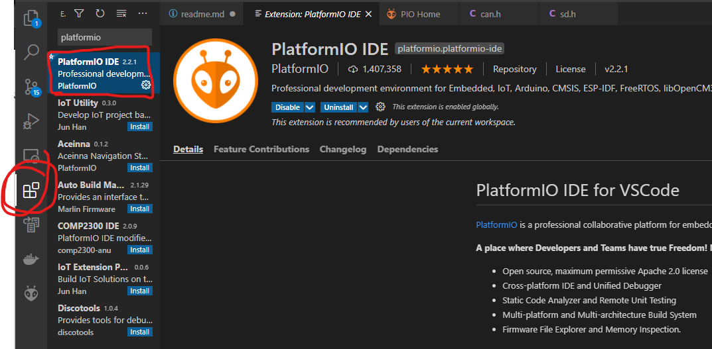
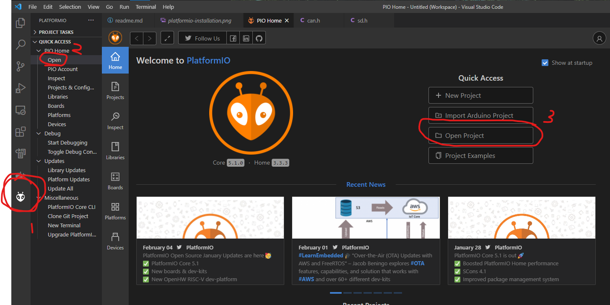

## Name: BFB
### Engineers: 
William Sun

## Description
The BFB controls two analog multiplexers that can read from 16 analog lines each.
The goal of the BFB is to read 26 analog voltages. These voltages correspond to a temperature
If any of the temperatures fall outside the operating range (0 degC to 60 degC), the teensy will output HIGH on pin 21 indicating a fault

The data sheets for the hardware components are as follows:
- 
- 
  - Table and graph of temperature vs voltage found on page 3

## Teensy Hardware Connections
Multiplexer 1:
- A0 (Address Line 0)
- A1 (Address Line 1)
- A2 (Address  Line 2)
- A3 (Address Line 3)
- EN (Enable pin)
- Output PIN (is it 14 or 15)

Multiplexer 2:
- A0 (Address Line 0)
- A1 (Address Line 1)
- A2 (Address  Line 2)
- A3 (Address Line 3)
- EN (Enable pin)
- Output PIN (is it 14 or 15)

The 26 analog lines are connected to the multiplexers in order
Populates all 16 lines of mux1 and 10 lines of mux2
The last 6 lines of mux2 (S11-S16) are the ones that are not populated

## Getting Started:
This section was taken and modified from the SSA (as they both use a teensy 3.5)

1) Install Visual Studio Code
2) Install Platformio extension 
   1) click the extension icon on the left
   2) find platformio ide
   3) click install
   - 
3) Open the Platformio project 
   1) click the platformio icon on the left
   2) click open (under PIO home)
   3) click open project, and navigate to BFB root directory
   - 
4) Build with tick button in the bottom left 
   - 
5) Upload built hex to the Teensy by pressing the upload button in the bottom left. It looks like a right arrow
   - 

## Helpful Notes:
- To see the Serial.print output, click the Serial Monitor button at the bottom left
  - 